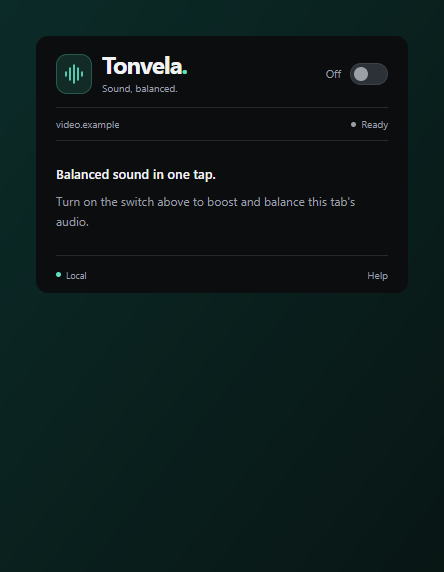
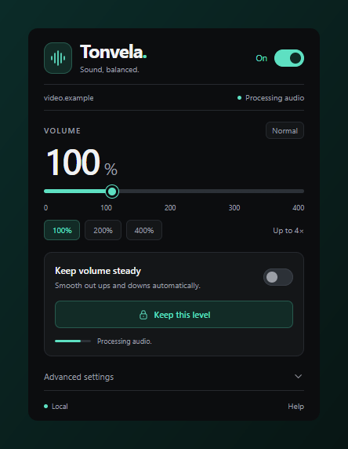
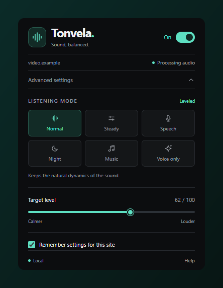

# Tonvela

**Her videoda dengeli ses.**
Sekme sesini yükselten, dengeleyen ve netleştiren Chrome eklentisi — tamamen cihazınızda çalışır.

[İndir](https://github.com/isolmaz/tonvela-chrome/releases/latest/download/Tonvela-Chrome.zip) · [Değişiklikler](CHANGELOG.md) · [Gizlilik](PRIVACY.md) · [Lisans](LICENSE)

[English](README.md) · **Türkçe**

   

## Nasıl çalışır

<table>
<tr>
<td width="33%" align="center"></td>
<td width="33%" align="center"></td>
<td width="33%" align="center"></td>
</tr>
<tr>
<td align="center"><b>1. Aç</b> Video sekmesinde anahtarı aç. Ölçer duyduğun sesi gösterir.</td>
<td align="center"><b>2. Yükselt ve dengele</b> %400'e kadar. <i>Sesi dengede tut</i> yüksek ve kısık bölümleri eşitler; <i>Bu ses seviyesini koru</i> şu an duyduğunu hedef yapar.</td>
<td align="center"><b>3. İnce ayar</b> Altı dinleme modu, hedef seviye, site hafızası, tema ve dil.</td>
</tr>
</table>

## Özellikler

- **%400'e kadar ses**, ileriye bakan tepe sınırlayıcıyla.
- **Sesi dengede tut:** kısık bölümler yükselir, yüksek bölümler azalır.
- **Bu ses seviyesini koru:** duyduğun seviye hedef olur; geri alınabilir.
- **Altı mod:** Normal, Sabit ses, Konuşma, Gece, Müzik ve deneysel **Sadece konuşma** (cihazda çalışan [GTCRN](https://github.com/Xiaobin-Rong/gtcrn) modeli, mono, ~50 ms gecikme).
- **Kısayollar:** <kbd>Alt</kbd>+<kbd>Shift</kbd>+<kbd>V</kbd> Tonvela'yı açar, <kbd>Alt</kbd>+<kbd>Shift</kbd>+<kbd>↑</kbd>/<kbd>↓</kbd> sesi değiştirir.
- **İngilizce veya Türkçe** arayüz (Gelişmiş ayarlar → Dil), koyu / açık / sistem teması.

## Kurulum

1. [`Tonvela-Chrome.zip`](https://github.com/isolmaz/tonvela-chrome/releases/latest/download/Tonvela-Chrome.zip) dosyasını indirip bir klasöre çıkar.
2. `chrome://extensions` sayfasını aç ve **Geliştirici modu**nu aç.
3. **Paketlenmemiş öğe yükle**'ye tıkla ve çıkardığın klasörü seç.
4. Bir video sekmesinde Tonvela'yı aç ve anahtarı çevir.

## Gizlilik

Ses tarayıcında işlenir ve dışarı çıkmaz. Sunucu, hesap, analiz, kayıt veya mikrofon yok. Tercihler `chrome.storage.local` içinde kalır. Ayrıntılar: [PRIVACY.md](PRIVACY.md).

## Geliştirme

Node.js 22+ ve Python 3 gerekir; eklentinin derleme adımı yoktur (`extension/` klasörünü **Paketlenmemiş öğe yükle** ile açın). CI (`.github/workflows/ci.yml`) her PR ve `main`'e her push'ta `npm run check` (lint + birim testleri) çalıştırır; aynı kontrolleri yerelde `npm run check` ile yapabilirsiniz. Tarayıcı ve ses modeli testleri CI'da çalışmaz (`npm run verify`). Komutlar ve testler için [İngilizce README](README.md#development) dosyasına bakın.

**Katkı:** `main`'e PR açın ve kullanıcıya dönük değişiklikleri [CHANGELOG.md](CHANGELOG.md) içindeki `## Unreleased` başlığı altına yazın. Sürüm numarasını değiştirmeyin; sürüm yayınlanırken belirlenir.

## Lisans

[MIT](LICENSE). Pakete dahil üçüncü taraf bileşenler (GTCRN, gtcrn-wasm, pffft) kendi lisanslarını korur; bkz. [THIRD_PARTY_NOTICES.txt](extension/THIRD_PARTY_NOTICES.txt).
